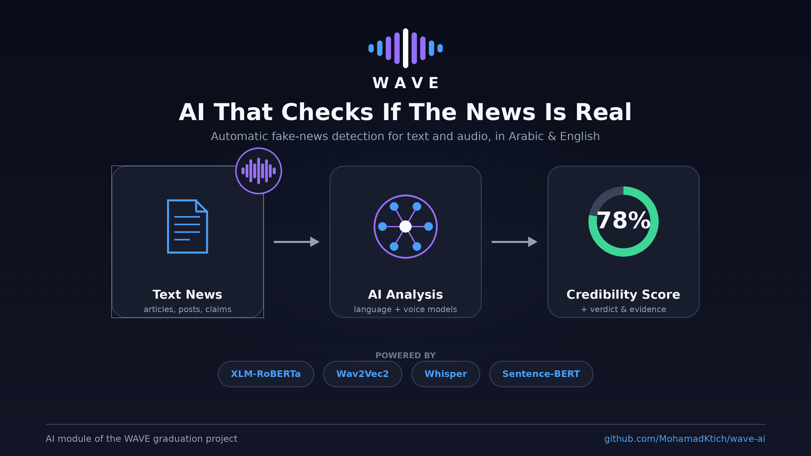
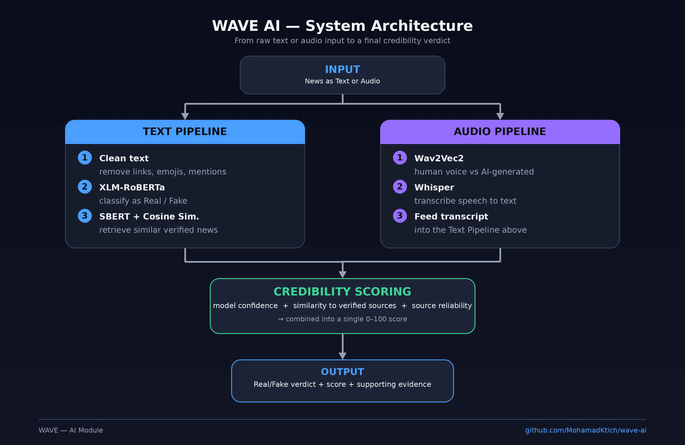
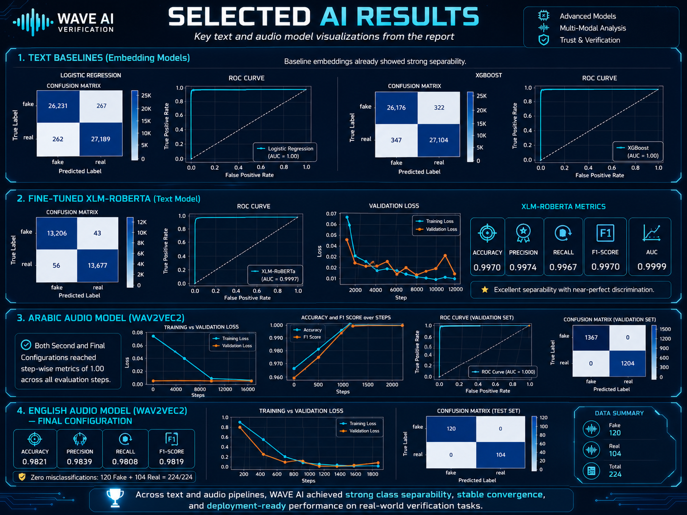
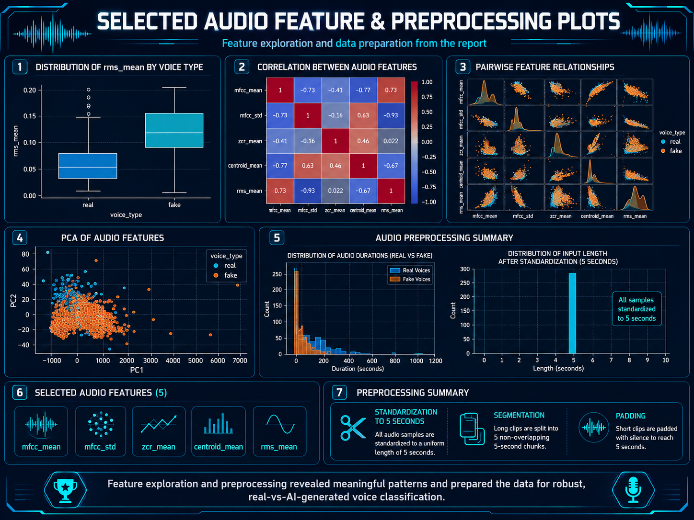

# WAVE — AI Module: Multilingual Fake News Detection (Text & Audio)



> AI/ML component of **WAVE**, a graduation project for detecting fake news in Arabic
> and English, across both text and audio content. This repository covers the parts I
> built: text classification, audio authenticity classification, semantic retrieval,
> and credibility scoring. (The project's NER and multilingual summarization modules
> were built by teammates and are not part of this repo.)

## Overview

Misinformation spreads fast, and in politically sensitive contexts — like Syria's
information landscape — it's often deliberate. WAVE checks a piece of news (text or
audio) and returns:

1. A **real/fake classification**
2. A **credibility score** (0–1)
3. The most similar **verified news items** as supporting evidence

## Architecture



## Selected AI Results



## Audio Feature Exploration & Preprocessing



## Tech stack

| Component | Technology |
|---|---|
| Text classification | `xlm-roberta-large` (fine-tuned, 100 languages) |
| Semantic retrieval | Sentence-BERT (`paraphrase-multilingual-MiniLM-L12-v2`) + cosine similarity |
| Audio authenticity | `Wav2Vec2` (separate fine-tuned models for Arabic & English) |
| Speech-to-text | OpenAI `Whisper` |
| Baselines explored | Logistic Regression, XGBoost, MLP |
| Serving | Flask / FastAPI |
| Training environment | Google Colab |

## Results

| Task | Model | Metric | Score |
|---|---|---|---|
| Text classification (final) | XLM-RoBERTa-large | Accuracy / F1 | ~0.997–1.0 (final iteration, see notebook 02) |
| Audio classification (English) | Wav2Vec2 | Accuracy | ~98.2% |
| Audio classification (Arabic) | Wav2Vec2 | — | see notebook 05 for full report |

> Full metrics, confusion matrices, and ROC curves are in `05_audio_wav2vec2_finetuning.ipynb`
> and `02_text_xlm_roberta_final_pipeline.ipynb`.

## Trained models (Hugging Face Hub)

- 🤗 [Text classifier — XLM-RoBERTa](https://huggingface.co/Ktich/wave-xlm-roberta-fakenews)
- 🤗 [Audio classifier — Arabic](https://huggingface.co/Ktich/wave-wav2vec2-arabic)
- 🤗 [Audio classifier — English](https://huggingface.co/Ktich/wave-wav2vec2-english)

## Repository structure

```
.
├── assets/
│   ├── project_poster.png
│   └── architecture_diagram.png
├── notebooks/
│   ├── 01_text_preprocessing_and_baselines.ipynb   # embeddings + LR/XGBoost/MLP baselines + early fine-tuning tries
│   ├── 02_text_xlm_roberta_final_pipeline.ipynb    # final training + retrieval + credibility pipeline
│   ├── 03_text_api_deployment.ipynb                # Flask serving for the text pipeline
│   ├── 04_audio_baseline_ml_experiments.ipynb      # acoustic features + baseline ML models
│   ├── 05_audio_wav2vec2_finetuning.ipynb          # audio preprocessing + Wav2Vec2 fine-tuning (AR & EN)
│   └── 06_audio_api_deployment.ipynb               # Flask serving for the audio pipeline
├── src/
│   └── api/
│       ├── flask_text_pipeline.py   # text pipeline API (loads model from HF Hub)
│       └── flask_api.py             # audio pipeline API (loads models from HF Hub)
├── data/
│   └── README.md         # why the dataset isn't published + how to request it
├── models/
│   └── README.md         # Hugging Face Hub links + how to load each model
├── requirements.txt
├── LICENSE
└── README.md
```

## Getting started

```bash
git clone https://github.com/MohamadKtich/wave-ai.git
cd wave-ai
pip install -r requirements.txt
```

Open any notebook in `notebooks/` — each starts with a markdown cell explaining its
purpose, inputs, and outputs. Notebooks 01–02 and 04–05 expect a labeled dataset
(see `data/README.md` for the schema and how to reproduce/request one); the deployment
notebooks (03, 06) load the trained models directly from Hugging Face Hub.

To run either API standalone (outside a notebook):

```bash
python src/api/flask_text_pipeline.py   # serves POST /analyze_text/  on :8000
python src/api/flask_api.py             # serves POST /analyze_audio/ on :8000
```

Both load their models straight from the Hugging Face Hub links in `models/README.md`.
The semantic-retrieval step also needs a local reference corpus (news texts + their
precomputed embeddings) pointed to by the `WAVE_DATA_DIR` env var — see `data/README.md`.

## Project context

This is the AI module of **WAVE**, a larger graduation project that also includes:
- Named Entity Recognition (NER) pipeline — built by a teammate
- Multilingual summarization — built by a teammate
- Full-stack web application (Node.js/Express backend, frontend) — built by teammates

This repository only covers the AI components listed above, built and maintained by
Mohamad Abdullatif Ktich.

## Portfolio positioning

This project demonstrates:
- Fine-tuning large transformer models (`xlm-roberta-large`, `wav2vec2-large-xlsr-53`) for real classification tasks
- Multilingual NLP (Arabic + English) and low-resource-language considerations
- Semantic search / retrieval with sentence embeddings and cosine similarity
- Audio ML: authenticity classification + Whisper-based transcription in one pipeline
- End-to-end ML lifecycle: dataset construction, baselines, iterative fine-tuning, evaluation, and REST API deployment
- Responsible publishing practices: separating code, models (Hugging Face Hub), and sensitive data

## License

MIT — see [LICENSE](LICENSE).

## Contact

**Mohamad Abdullatif Ktich**
📧 [Ktichmohamad@gmail.com](mailto:Ktichmohamad@gmail.com)
🔗 [linkedin.com/in/mohamad-ktich](https://www.linkedin.com/in/mohamad-ktich)
